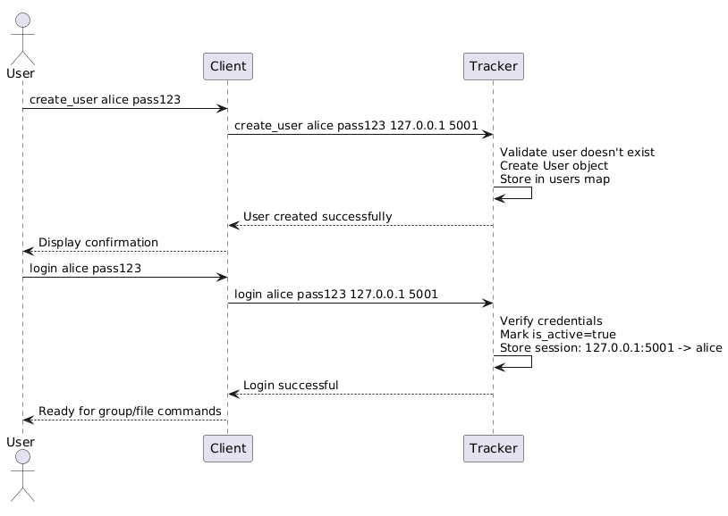
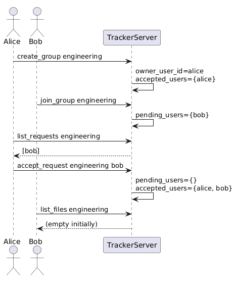
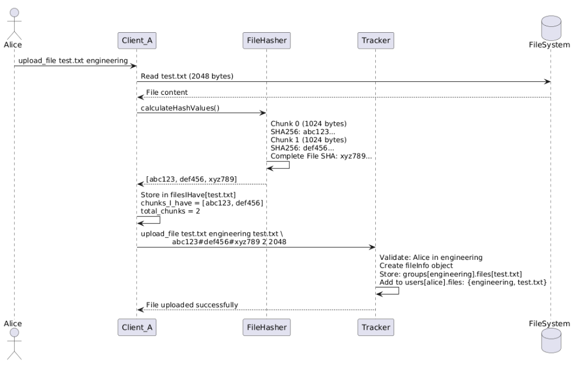

# P2P File Sharing System

A peer-to-peer (P2P) distributed file sharing system implemented in C++.


## Overview

This system will enable users to:
1. **Organize files** into groups with controlled membership
2. **Upload files** with automatic chunking (1024 bytes) and SHA256 verification
3. **Download files** from multiple peers in parallel with rarest-first scheduling
4. **Verify integrity** at both chunk and file level
5. **Coordinate** through a centralized tracker

### Key Metrics
- **Chunk Size:** 1024 bytes
- **Parallel Downloads:** Up to 15 concurrent chunk transfers
- **Verification:** SHA256 EVP implementation
- **Transport:** TCP/IP sockets with persistent connections

---

## Quick Start

### Prerequisites
```bash
# Ubuntu/Debian
sudo apt-get install g++ libssl-dev

# macOS
brew install openssl
```

### Build
```bash
cd /path/to/p2p-file-sharing-system

# Compile tracker
g++ -o tracker/tracker tracker/tracker.cpp -pthread -lssl -lcrypto

# Compile client
g++ -o client/client client/client.cpp -pthread -lssl -lcrypto -std=c++11
```

### Run (3 terminals)

**Terminal 1 - Tracker:**
```bash
cd tracker
./tracker tracker_info.txt 1

# tracker_info.txt contains: 127.0.0.1 9000
```

**Terminal 2 - Client A:**
```bash
cd client
./client 127.0.0.1:5001 ../tracker/tracker_info.txt

# Commands:
# > create_user alice password123
# > login alice password123
# > create_group group1
# > accept_request group1 bob
# > upload_file test.txt group1
```

**Terminal 3 - Client B:**
```bash
cd client
./client 127.0.0.1:5002 ../tracker/tracker_info.txt

# Commands:
# > create_user bob password123
# > login bob password123
# > join_group group1
```

---


## Sequence Diagrams

### 1. User Registration & Authentication


### 2. Group Membership Flow


### 3. File Upload Flow



